SVD Approx
================
Sara Stoudt
12/2/2020

``` r
require(ggplot2)
```

    ## Loading required package: ggplot2

    ## Warning: package 'ggplot2' was built under R version 3.5.2

``` r
## get a lower rank approximation to a higher rank matrix
svdApprox <- function(mat, numFactors){
#browser()
  test=svd(mat,nu = numFactors,nv = numFactors)
  
  test$u %*% (diag(numFactors)*test$d[1:numFactors]) %*% t(test$v)
}
```

#### low rank plus

``` r
setwd("/Users/Sara/Desktop/communityDimensions/R/simulation_setup")
load(file="test_data/testLFMats_lowRankPlus.RData")
load(file="test_data/testPerturbMats_lowRankPlus.RData")


numSpecies = 15
numSites = 100

strength = 1 
signal = 1
numFactors = c(1, 2, 3, 5, 10)
sparsity <- c(0.9, 0.5, 0.2)


mixture <- seq(0, 1, by=.2) ## interpolate between latent factor matrix and perturbation matrix

scenarios = expand.grid(numFactors = numFactors, sparsity = sparsity, mixture = mixture)

lowRankApprox = vector("list",length(lfM))
for(i in 1:length(lfM)){
  mixture= scenarios[i,3]
  mat = lfM[[i]]
  addM = perturbM[[i]]
  lowRankApprox[[i]]=svdApprox(mixture*mat+(1-mixture)*solve(as.matrix(addM)), scenarios[i,1])
}
```

    ## Loading required package: Matrix

``` r
source("metrics.R")
```

``` r
kl <- c()
frob <- c()
for(i in 1:length(lfM)){
  mixture= scenarios[i,3]
  mat = lfM[[i]]
  addM = perturbM[[i]]
  kl <- c(kl, klDivergence(lowRankApprox[[i]]+diag(nrow(lfM[[i]])), mixture*mat+(1-mixture)*solve(as.matrix(addM)) +diag(nrow(lfM[[i]])) ))
  frob <- c(frob, frobeniusNorm(lowRankApprox[[i]], mixture*mat+(1-mixture)*solve(as.matrix(addM))))
}

results = cbind.data.frame(scenarios, kl, frob)
```

``` r
ggplot(subset(results, numFactors==1), aes(mixture, kl,col=as.factor(numFactors)))+geom_point(cex=2)+geom_line()+facet_wrap(~sparsity)+theme_minimal()
```

<!-- -->

``` r
ggplot(subset(results, numFactors==1), aes(mixture, frob,col=as.factor(numFactors)))+geom_point(cex=2)+geom_line()+facet_wrap(~sparsity)+theme_minimal()
```

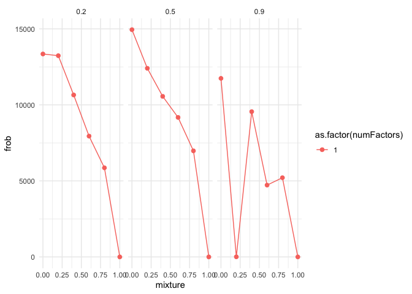<!-- -->

``` r
ggplot(subset(results, numFactors==2), aes(mixture, kl,col=as.factor(numFactors)))+geom_point(cex=2)+geom_line()+facet_wrap(~sparsity)+theme_minimal()
```

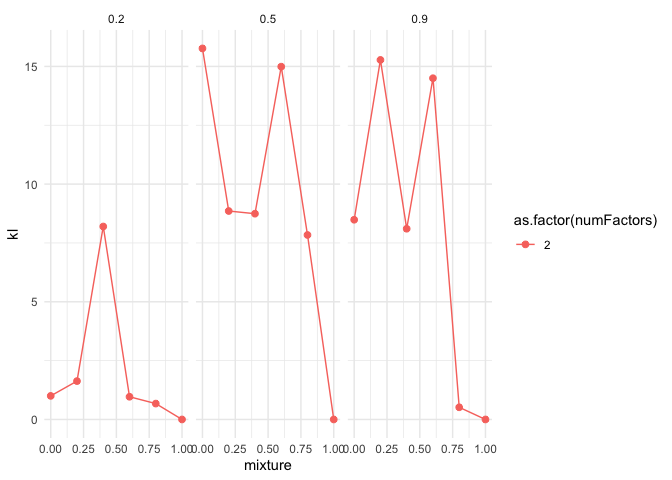<!-- -->

``` r
ggplot(subset(results, numFactors==2), aes(mixture, frob,col=as.factor(numFactors)))+geom_point(cex=2)+geom_line()+facet_wrap(~sparsity)+theme_minimal()
```

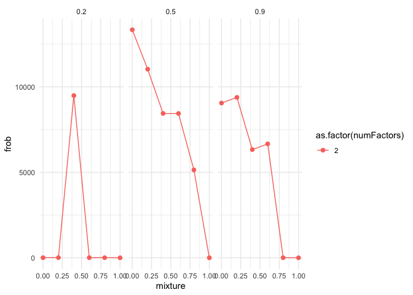<!-- -->

``` r
ggplot(subset(results, numFactors==5), aes(mixture, kl,col=as.factor(numFactors)))+geom_point(cex=2)+geom_line()+facet_wrap(~sparsity)+theme_minimal()
```

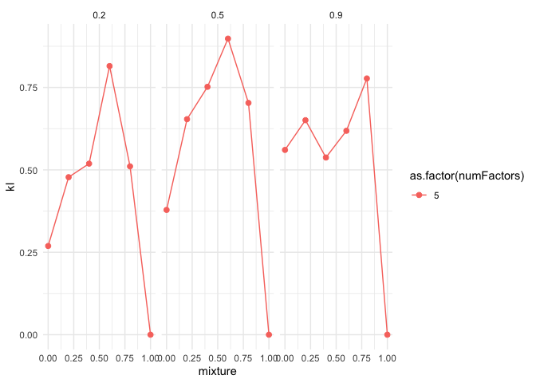<!-- -->

``` r
ggplot(subset(results, numFactors==5), aes(mixture, frob,col=as.factor(numFactors)))+geom_point(cex=2)+geom_line()+facet_wrap(~sparsity)+theme_minimal()
```

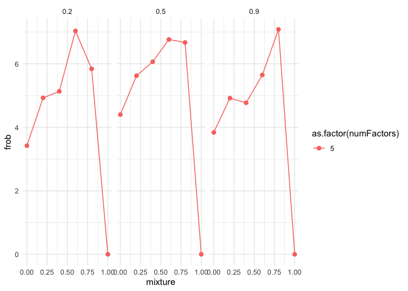<!-- -->

``` r
ggplot(subset(results, numFactors==10), aes(mixture, kl,col=as.factor(numFactors)))+geom_point(cex=2)+geom_line()+facet_wrap(~sparsity)+theme_minimal()
```

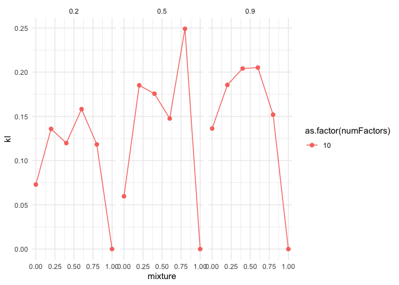<!-- -->

``` r
ggplot(subset(results, numFactors==10), aes(mixture, frob,col=as.factor(numFactors)))+geom_point(cex=2)+geom_line()+facet_wrap(~sparsity)+theme_minimal()
```

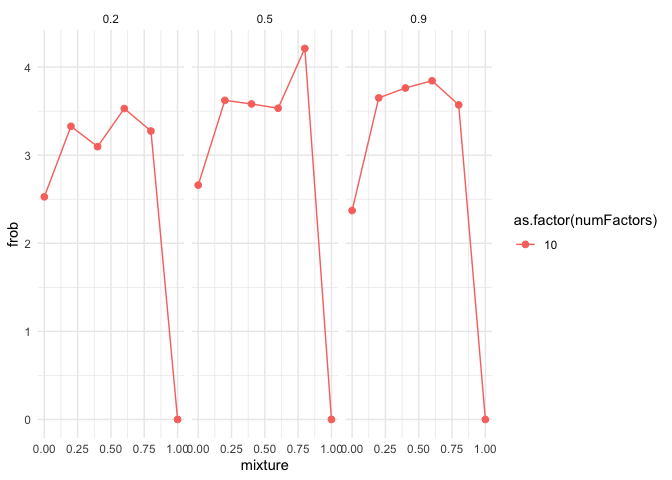<!-- -->

### correctly specified but not enough latent factors

``` r
setwd("/Users/Sara/Desktop/communityDimensions/R/simulation_setup")

load( file = "test_data/testMats_correctlySpecified.RData")


numSpecies <- c(5, 10, 15, 20, 25, 30)
numFactors <- c(1, 2, 5, 10, 20)

scenarios = expand.grid(numSpecies = numSpecies, numFactors = numFactors)

goodRatio = subset(scenarios, numSpecies==5)
```

``` r
klDivergence(svdApprox(trueMats[[7]],1)+diag(nrow(trueMats[[7]])), trueMats[[7]]+diag(nrow(trueMats[[7]])))
```

    ## [1] 0.02505892

``` r
frobeniusNorm(svdApprox(trueMats[[7]],1)+diag(nrow(trueMats[[7]])), trueMats[[7]]+diag(nrow(trueMats[[7]])))
```

    ## [1] 1.158522

``` r
## weird but look at scale, fine
plot(1:4, c(
klDivergence(svdApprox(trueMats[[13]], 1)+diag(nrow(trueMats[[13]])), trueMats[[13]]),
klDivergence(svdApprox(trueMats[[13]], 2)+diag(nrow(trueMats[[13]])), trueMats[[13]]),
klDivergence(svdApprox(trueMats[[13]], 3)+diag(nrow(trueMats[[13]])), trueMats[[13]]),
klDivergence(svdApprox(trueMats[[13]], 4)+diag(nrow(trueMats[[13]])), trueMats[[13]])
),xlab="number of latent factors", ylab="kl")
```

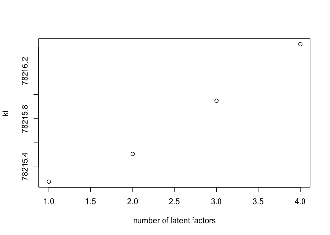<!-- -->

``` r
plot(1:4, c(
frobeniusNorm(svdApprox(trueMats[[13]], 1), trueMats[[13]]),
frobeniusNorm(svdApprox(trueMats[[13]], 2), trueMats[[13]]),
frobeniusNorm(svdApprox(trueMats[[13]], 3), trueMats[[13]]),
frobeniusNorm(svdApprox(trueMats[[13]], 4), trueMats[[13]])
),xlab="number of latent factors", ylab="frob")
```

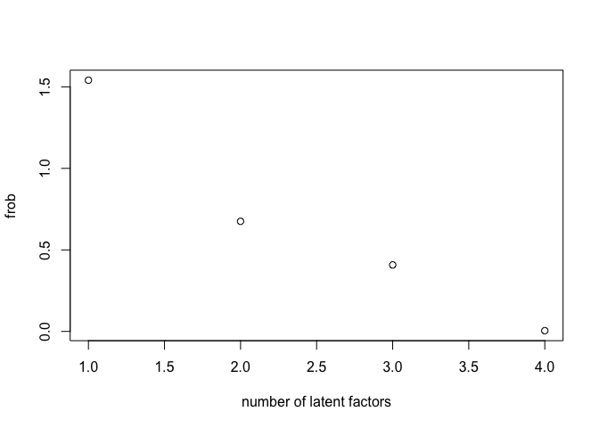<!-- -->

``` r
## can't have 10 factors with 5 species
plot(1:9, c(
klDivergence(svdApprox(trueMats[[20]], 1)+diag(nrow(trueMats[[20]])), trueMats[[20]]+diag(nrow(trueMats[[20]]))),
klDivergence(svdApprox(trueMats[[20]], 2)+diag(nrow(trueMats[[20]])), trueMats[[20]]+diag(nrow(trueMats[[20]]))),
klDivergence(svdApprox(trueMats[[20]], 3)+diag(nrow(trueMats[[20]])), trueMats[[20]]+diag(nrow(trueMats[[20]]))),
klDivergence(svdApprox(trueMats[[20]], 4)+diag(nrow(trueMats[[20]])), trueMats[[20]]+diag(nrow(trueMats[[20]]))),
klDivergence(svdApprox(trueMats[[20]], 5)+diag(nrow(trueMats[[20]])), trueMats[[20]]+diag(nrow(trueMats[[20]]))),
klDivergence(svdApprox(trueMats[[20]], 6)+diag(nrow(trueMats[[20]])), trueMats[[20]]+diag(nrow(trueMats[[20]]))),
klDivergence(svdApprox(trueMats[[20]], 7)+diag(nrow(trueMats[[20]])), trueMats[[20]]+diag(nrow(trueMats[[20]]))),
klDivergence(svdApprox(trueMats[[20]], 8)+diag(nrow(trueMats[[20]])), trueMats[[20]]+diag(nrow(trueMats[[20]]))),
klDivergence(svdApprox(trueMats[[20]], 9)+diag(nrow(trueMats[[20]])), trueMats[[20]]+diag(nrow(trueMats[[20]])))
),xlab="number of latent factors", ylab="kl")
```

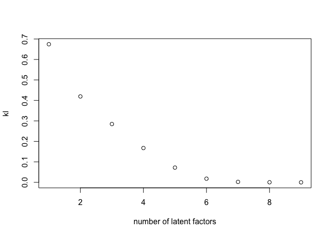<!-- -->

``` r
plot(1:9, c(
frobeniusNorm(svdApprox(trueMats[[20]], 1), trueMats[[20]]),
frobeniusNorm(svdApprox(trueMats[[20]], 2), trueMats[[20]]),
frobeniusNorm(svdApprox(trueMats[[20]], 3), trueMats[[20]]),
frobeniusNorm(svdApprox(trueMats[[20]], 4), trueMats[[20]]),
frobeniusNorm(svdApprox(trueMats[[20]], 5), trueMats[[20]]),
frobeniusNorm(svdApprox(trueMats[[20]], 6), trueMats[[20]]),
frobeniusNorm(svdApprox(trueMats[[20]], 7), trueMats[[20]]),
frobeniusNorm(svdApprox(trueMats[[20]], 8), trueMats[[20]]),
frobeniusNorm(svdApprox(trueMats[[20]], 9), trueMats[[20]])
),xlab="number of latent factors", ylab="frob")
```

<!-- -->

``` r
plot(c(1,3,5,7,10,12,15,17),c(
klDivergence(svdApprox(trueMats[[28]],1)+diag(nrow(trueMats[[28]])), trueMats[[28]]+diag(nrow(trueMats[[28]]))),
klDivergence(svdApprox(trueMats[[28]],3)+diag(nrow(trueMats[[28]])), trueMats[[28]]+diag(nrow(trueMats[[28]]))),
klDivergence(svdApprox(trueMats[[28]],5)+diag(nrow(trueMats[[28]])), trueMats[[28]]+diag(nrow(trueMats[[28]]))),
klDivergence(svdApprox(trueMats[[28]],7)+diag(nrow(trueMats[[28]])), trueMats[[28]]+diag(nrow(trueMats[[28]]))),
klDivergence(svdApprox(trueMats[[28]],10)+diag(nrow(trueMats[[28]])), trueMats[[28]]+diag(nrow(trueMats[[28]]))),
klDivergence(svdApprox(trueMats[[28]],12)+diag(nrow(trueMats[[28]])), trueMats[[28]]+diag(nrow(trueMats[[28]]))),
klDivergence(svdApprox(trueMats[[28]],15)+diag(nrow(trueMats[[28]])), trueMats[[28]]+diag(nrow(trueMats[[28]]))),
klDivergence(svdApprox(trueMats[[28]],17)+diag(nrow(trueMats[[28]])), trueMats[[28]]+diag(nrow(trueMats[[28]]))
)),xlab="number of latent factors", ylab="kl")
```

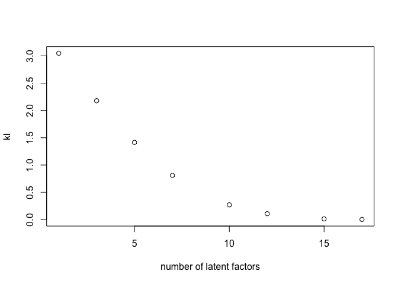<!-- -->

``` r
plot(c(1,3,5,7,10,12,15,17),c(
frobeniusNorm(svdApprox(trueMats[[28]],1), trueMats[[28]]),
frobeniusNorm(svdApprox(trueMats[[28]],3), trueMats[[28]]),
frobeniusNorm(svdApprox(trueMats[[28]],5), trueMats[[28]]),
frobeniusNorm(svdApprox(trueMats[[28]],7), trueMats[[28]]),
frobeniusNorm(svdApprox(trueMats[[28]],10), trueMats[[28]]),
frobeniusNorm(svdApprox(trueMats[[28]],12), trueMats[[28]]),
frobeniusNorm(svdApprox(trueMats[[28]],15), trueMats[[28]]),
frobeniusNorm(svdApprox(trueMats[[28]],17), trueMats[[28]])
),xlab="number of latent factors", ylab="frob")
```

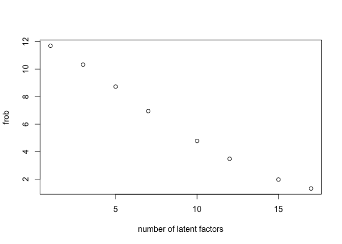<!-- -->
